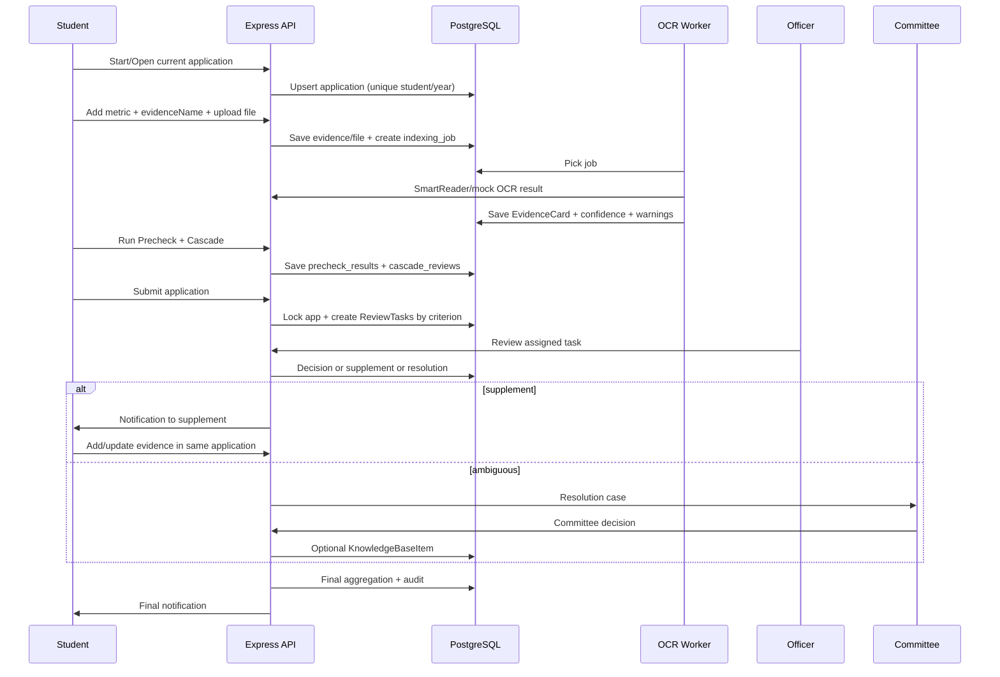
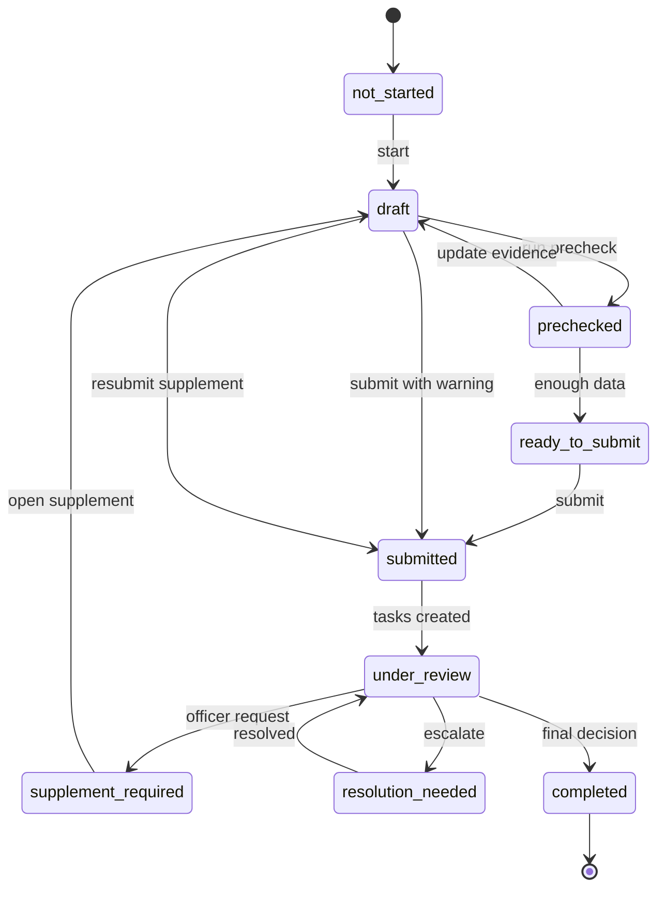
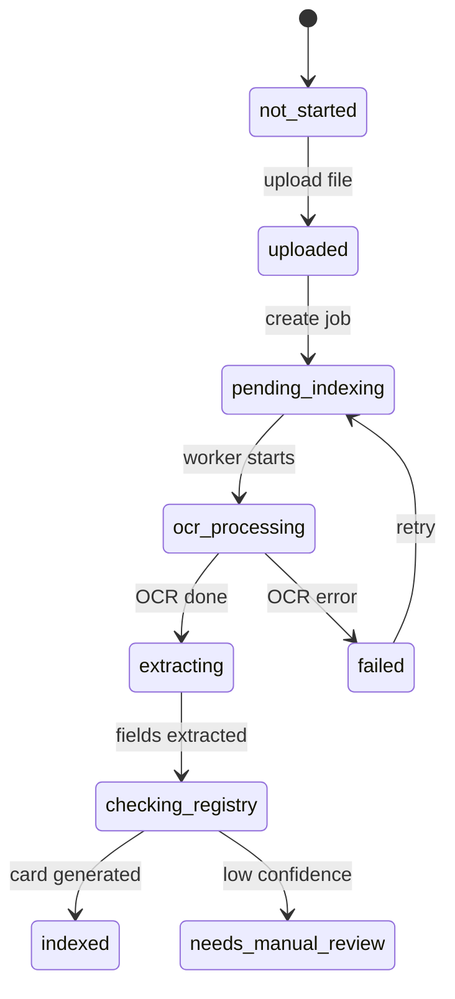

# 5TOT Backend Business Flows

ExpressJS + TypeScript + Supabase PostgreSQL Database Only

Tài liệu này bổ sung cho backend implementation guide: tập trung vào luồng nghiệp vụ, trạng thái, actor, transaction, API mapping và test acceptance để team backend implement đúng FE hiện tại và đúng proposal 5TOT.

## 0. Nguồn bám logic

Tài liệu bám theo proposal 5TOT: sinh viên nộp một bộ hồ sơ, chọn cấp aim; hệ thống OCR/minh chứng, tạo Evidence Card, đối chiếu tiêu chí, phân luồng cán bộ, Resolution Hub, audit; AI hỗ trợ nhưng cán bộ/Hội đồng xác nhận quyết định cuối cùng. Backend guide trước đó đã xác định ExpressJS chịu auth, phân quyền, workflow, rules engine, OCR orchestration, audit; Supabase chỉ dùng PostgreSQL database.

## 1. Nguyên tắc nghiệp vụ bắt buộc

| Mã | Nguyên tắc | Backend phải enforce |
| --- | --- | --- |
| P01 | Một sinh viên chỉ có một hồ sơ cá nhân trong một năm học. | Unique constraint: student_id + school_year + application_type = individual. API start phải idempotent. |
| P02 | Một hồ sơ chỉ có một bản nháp đang cập nhật liên tục. | Không tạo nhiều draft active. Draft snapshot chỉ dùng cho lịch sử/audit. |
| P03 | Cấp aim là field trong hồ sơ, không phải hồ sơ riêng. | target_level thuộc applications. Cascade Review chỉ tạo result, không tạo application mới. |
| P04 | Mỗi minh chứng bắt buộc có tên minh chứng. | Validate evidence_name required ở create/update evidence/import event. |
| P05 | Không phải mọi minh chứng đều upload file. | Hỗ trợ metric_input, event_import, manual_upload, collective_import. |
| P06 | AI không chốt kết quả. | Route AI chỉ tạo suggestion/confidence/warning. Final result do officer/committee action. |
| P07 | Cán bộ xét duyệt theo tiêu chí chuyên trách. | ReviewTask theo criterion/evidence; officer chỉ thấy task được giao hoặc đúng specialization. |
| P08 | Event Registry và Evidence Knowledge Base là hai kho khác nhau. | Event Registry cho danh sách sự kiện đã xác nhận; KB cho tiền lệ duyệt/từ chối và lỗi thường gặp. |
| P09 | Tập thể SV5T follow bộ tiêu chí tập thể. | Collective profile có roster, tỷ lệ, minh chứng theo tiêu chí; không chỉ upload ảnh hoạt động. |
| P10 | Mọi thao tác quan trọng phải có audit. | Create audit log trong transaction cho submit, OCR, import, review decision, supplement, resolution, export. |

## 2. Actor và quyền nghiệp vụ

| Actor | Vai trò nghiệp vụ | Quyền chính | Không được làm |
| --- | --- | --- | --- |
| Student | Chuẩn bị và nộp hồ sơ cá nhân. | Xem/tạo hồ sơ hiện tại, autosave draft, nhập chỉ số, upload/import minh chứng, chạy precheck, submit, bổ sung khi được mở. | Không tạo nhiều hồ sơ cùng năm; không sửa hồ sơ sau submit trừ supplement window. |
| Class Representative | Đại diện lớp/chi hội làm hồ sơ tập thể. | Quản lý collective profile, import roster, upload/import minh chứng tập thể, submit hồ sơ tập thể. | Không sửa hồ sơ cá nhân của sinh viên khác. |
| Officer | Cán bộ xét duyệt chuyên trách tiêu chí. | Xem task được giao, xét minh chứng, yêu cầu bổ sung, chuyển Resolution Hub, xác nhận task. | Không chốt final toàn hồ sơ nếu không có quyền manager/committee. |
| Manager | Quản lý quy trình, phân công, tổng hợp. | Xem toàn bộ hồ sơ, phân công/reassign task, xem workload, aggregation, export nháp. | Không bỏ qua audit hoặc ghi kết quả không qua task. |
| Committee | Chốt hồ sơ mập mờ và kết quả cuối. | Xem Resolution Hub, quyết định case mập mờ, confirm final result, ghi KB tiền lệ. | Không để AI update final tự động. |
| Admin | Cấu hình hệ thống. | Quản lý user, role, criteria version, system config. | Không can thiệp dữ liệu xét nếu không ghi audit. |

## 3. State machine cốt lõi

### 3.1. ApplicationStatus

```txt
not_started -> draft -> prechecked -> ready_to_submit -> submitted -> under_review -> completed
                         |              |             |              |
                         |              |             |              -> supplement_required -> draft_supplement -> submitted
                         |              |             -> resolution_needed -> under_review/completed
                         -> draft       -> draft

Rules:
- not_started chỉ là trạng thái virtual khi chưa có application.
- draft/prechecked/ready_to_submit: student có thể sửa tự do.
- submitted/under_review: lock hồ sơ.
- supplement_required: chỉ mở đúng tiêu chí/minh chứng được yêu cầu.
- completed/rejected: read-only, chỉ committee/admin có thể reopen bằng action có audit.
```

### 3.2. Evidence IndexingStatus

```txt
not_started -> uploaded -> pending_indexing -> ocr_processing -> extracting -> checking_registry -> indexed
                                                            |                 |                    |
                                                            -> failed         -> needs_manual_review -> indexed
Rules:
- manual_upload luôn đi qua job OCR/indexing.
- event_import có thể indexed ngay nếu participant record đã confirmed.
- metric_input không cần OCR, nhưng có thể có evidence_file_id để verify.
```

### 3.3. ReviewTaskStatus

```txt
waiting -> reviewing -> accepted
                    -> rejected
                    -> supplement_required -> waiting/reviewing
                    -> resolution_needed -> accepted/rejected
Rules:
- Task thuộc 1 criterion và 1 assigned_officer_id.
- Task có thể link nhiều evidence cùng tiêu chí.
- Application chỉ đủ điều kiện aggregation khi các task bắt buộc đã accepted/rejected hoặc có committee decision.
```

### 3.4. ResolutionCaseStatus

```txt
open -> analyzing -> committee_review -> resolved -> knowledge_base_updated(optional)
     -> rejected/closed
Rules:
- Chỉ tạo resolution case khi AI confidence thấp, officer không đủ căn cứ, mâu thuẫn rules/KB, hoặc tiêu chí chưa rõ.
- Quyết định committee có thể tạo KnowledgeBaseItem nếu được đánh dấu reusable.
```

## 4. Business Flow Catalog

| Flow | Tên luồng | Module chính | Actor chính | Kết quả |
| --- | --- | --- | --- | --- |
| F01 | Login & Role Routing | auth/users | Tất cả | JWT + profile + quyền role. |
| F02 | Single Individual Application | applications | Student | Tạo/mở một hồ sơ duy nhất theo năm. |
| F03 | Metric Input | metrics/applications | Student | Nhập GPA, điểm rèn luyện, điểm thể dục, ngày tình nguyện rõ ràng. |
| F04 | Manual Evidence Upload + OCR | evidences/files/jobs/ai | Student/Officer | Upload file, pending indexing, SmartReader/mock OCR, Evidence Card. |
| F05 | HSV/Đoàn Event Roster Indexing | event-registry/jobs/ai | Officer/Manager | Upload danh sách sự kiện, OCR bảng, map cột, confirm batch. |
| F06 | Student Import From Event Registry | event-registry/evidences | Student | Check MSSV trong roster đã index và import thành evidence. |
| F07 | Evidence Knowledge Base Search | knowledge-base/evidences | Student/Officer | Search tên minh chứng/sự kiện/case tương tự. |
| F08 | AI Precheck | precheck/rules/ai | Student/Officer | Rules Engine + Evidence Card -> readiness, missing, next action. |
| F09 | Cascade Review | cascade/rules | Student/Officer | Check từ target_level xuống cấp phù hợp, không chốt final. |
| F10 | Official Submit & Task Creation | applications/review/audit | Student | Khóa hồ sơ, tạo task chuyên trách theo tiêu chí. |
| F11 | Officer Specialized Review | review/evidences/kb | Officer | Queue task theo chuyên trách, approve/reject/request supplement/escalate. |
| F12 | Supplement Request & Resubmission | review/applications/notifications | Officer/Student | Mở bổ sung đúng tiêu chí, student update, task quay lại review. |
| F13 | Resolution Hub | resolution/kb/audit | Officer/Committee | Xử lý case mập mờ, chốt quyết định, có thể ghi KB. |
| F14 | Manager Assignment & Aggregation | manager/review | Manager | Phân công, workload, tổng hợp 5 tiêu chí và trạng thái final. |
| F15 | Collective SV5T Profile | collective/event-registry/rules | Class Rep/Manager | Tập thể một hồ sơ/lớp/năm, roster, tỷ lệ, minh chứng tập thể. |
| F16 | Notifications & Audit Timeline | notifications/audit | Tất cả | Thông báo trạng thái và truy vết mọi action. |
| F17 | Smartbot / Reviewer Copilot | chatbot/ai/kb | Student/Officer | Hỏi đáp tiêu chí, trạng thái, draft phản hồi. |
| F18 | SmartUX Tracking | smartux/audit | Manager | Ghi event UX, đo điểm nghẽn flow. |
| F19 | Final Decision & Export | manager/resolution/export | Manager/Committee | Chốt kết quả, xuất danh sách/báo cáo, lock hồ sơ. |

## F01. Login & Role Routing

**Mục tiêu:** Xác thực người dùng và đưa vào workspace đúng role.

**Trigger:** Người dùng nhập email/password hoặc chọn demo account.

**Điều kiện trước:** User tồn tại và active.

### Luồng chính

1. FE gọi POST /api/auth/login.

2. Backend verify password bằng bcrypt, tạo JWT access token và refresh token nếu có.

3. Backend trả về profile gồm role, student_code, officer_specializations, permissions.

4. FE route sang Student/Officer/Manager/Committee workspace.

5. Mọi request sau kèm Bearer token; middleware attach req.user.

### Bảng/API liên quan

| Nhóm | Chi tiết |
| --- | --- |
| Tables | users, officer_specializations, refresh_tokens, audit_logs |
| APIs | POST /api/auth/login; GET /api/me; POST /api/auth/logout |
| Transaction boundary | Login không cần transaction; logout/revoke token ghi audit nếu cần. |
| Exception/edge cases | Sai mật khẩu; user inactive; officer chưa có specialization; token hết hạn. |
| Acceptance criteria | User login được; /api/me trả đúng role; officer thấy tiêu chí chuyên trách. |

## F02. Single Individual Application & Draft

**Mục tiêu:** Đảm bảo mỗi sinh viên chỉ có một hồ sơ SV5T cá nhân/năm và một bản nháp đang cập nhật.

**Trigger:** Student vào dashboard hoặc bấm Bắt đầu hồ sơ.

**Điều kiện trước:** User role student, có student_code.

### Luồng chính

1. FE gọi GET /api/applications/current?schoolYear=2025-2026.

2. Nếu chưa có, FE bấm start -> POST /api/applications/current/start.

3. Backend dùng upsert/idempotent create theo unique(student_id, school_year, individual).

4. Student cập nhật target_level, thông tin cơ bản, autosave draft.

5. Backend cập nhật current_draft_version và tạo application_draft_snapshots theo nhịp hợp lý.

6. Audit ghi: APPLICATION_STARTED, TARGET_LEVEL_UPDATED, DRAFT_AUTOSAVED.

### Bảng/API liên quan

| Nhóm | Chi tiết |
| --- | --- |
| Tables | applications, application_draft_snapshots, audit_logs |
| APIs | GET /api/applications/current; POST /api/applications/current/start; PATCH /api/applications/:id/target-level; PATCH /api/applications/:id/draft |
| Transaction boundary | Start application phải transaction nếu tạo application + audit. Autosave có thể không transaction nếu chỉ update + audit nhẹ. |
| Exception/edge cases | Sinh viên đổi cấp aim nhiều lần; start bị gọi lặp; hồ sơ đã submitted thì không cho autosave tự do. |
| Acceptance criteria | Không tạo được nhiều hồ sơ cùng năm; dashboard luôn show một hồ sơ chính; target_level là field. |

## F03. Metric Input: GPA, Conduct Score, Physical Score

**Mục tiêu:** Xử lý các dữ liệu có ngưỡng rõ ràng bằng form + Rules Engine, không ép OCR tất cả.

**Trigger:** Student bấm Thêm minh chứng -> Nhập chỉ số.

**Điều kiện trước:** Application ở draft/prechecked/ready_to_submit hoặc supplement window.

### Luồng chính

1. Student chọn metric_type: gpa, conduct_score, physical_score, volunteer_days.

2. Student nhập value/scale và tên minh chứng liên quan.

3. Nếu có file xác nhận, upload file metadata nhưng metric vẫn là nguồn chính cho Rules Engine.

4. Backend validate range: GPA 0-4 hoặc 0-10, conduct 0-100, days >=0.

5. Rules Engine dùng metric để đánh giá điều kiện rõ ràng; officer có thể verify/reject.

### Bảng/API liên quan

| Nhóm | Chi tiết |
| --- | --- |
| Tables | application_metrics, files, evidences(optional), audit_logs |
| APIs | POST /api/applications/:id/metrics; PATCH /api/metrics/:id; POST /api/evidences/:id/files |
| Transaction boundary | Create/update metric + audit trong transaction. |
| Exception/edge cases | GPA vượt thang; đổi thang điểm; có điểm F; điểm rèn luyện thiếu file xác nhận; hồ sơ submitted. |
| Acceptance criteria | GPA/điểm rèn luyện nhập được; precheck đọc metric; officer thấy verification_status. |

## F04. Manual Evidence Upload + SmartReader/OCR + Evidence Card

**Mục tiêu:** Biến file minh chứng thủ công thành Evidence Card có cấu trúc, confidence và warning.

**Trigger:** Student thêm minh chứng bằng Upload file hoặc officer upload bổ sung thay student.

**Điều kiện trước:** Evidence có evidence_name, criterion, source_type=manual_upload.

### Luồng chính

1. FE tạo evidence trước: POST /api/applications/:id/evidences với evidence_name required.

2. FE upload file: POST /api/evidences/:id/files.

3. Backend lưu file local/S3 abstraction và file metadata.

4. Backend set indexing_status=uploaded/pending_indexing và tạo indexing_job job_type=evidence_ocr.

5. Worker lấy job, gọi mock/SmartReader adapter, lưu raw response nếu có.

6. Evidence Card Generator bóc tách fields: tên, ngày, đơn vị, cấp tổ chức, số ngày, chứng chỉ, GPA nếu có.

7. Confidence Scorer tính điểm dựa trên OCR quality, đủ field, match Event/KB, conflict.

8. Backend update evidence_cards, evidences.indexing_status=indexed/needs_manual_review, audit.

### Bảng/API liên quan

| Nhóm | Chi tiết |
| --- | --- |
| Tables | evidences, files, evidence_files, indexing_jobs, evidence_cards, knowledge_base_items, audit_logs |
| APIs | POST /api/applications/:id/evidences; POST /api/evidences/:id/files; POST /api/evidences/:id/start-indexing; GET /api/evidences/:id/card |
| Transaction boundary | Upload file + create job + audit trong transaction. Worker update card + evidence status + audit trong transaction. |
| Exception/edge cases | OCR fail; file quá lớn; ảnh mờ; thiếu ngày/đơn vị; OCR nhận nhầm tên; duplicate evidence. |
| Acceptance criteria | Upload chuyển pending_indexing; job hoàn thành sinh Evidence Card; warning hiển thị rõ; AI không tự duyệt. |

## F05. HSV/Đoàn Event Roster Indexing Center

**Mục tiêu:** Cán bộ upload danh sách sự kiện, OCR/index thành Event Registry để sinh viên import nhanh.

**Trigger:** Officer/Manager tạo event và upload roster file.

**Điều kiện trước:** User role officer/manager, event metadata đủ tên sự kiện và tiêu chí.

### Luồng chính

1. Cán bộ tạo EventRegistry: event_name, criterion, organizer, organizer_level, time, converted_value/unit.

2. Upload roster file: PDF/Excel/CSV/ảnh; backend lưu file và tạo event_file.

3. Start indexing -> tạo indexing_job job_type=event_roster_ocr.

4. Worker OCR/table extraction, sinh bảng preview và gợi ý column mapping.

5. Cán bộ kiểm tra, map cột: Họ tên, MSSV, lớp, khoa, trạng thái, số ngày/buổi.

6. Cán bộ bấm confirm batch; backend tạo/upsert event_participants, set roster_indexed=true, status=approved.

7. Audit ghi EVENT_INDEXED_CONFIRMED; event xuất hiện ở student event library.

### Bảng/API liên quan

| Nhóm | Chi tiết |
| --- | --- |
| Tables | event_registries, event_files, files, indexing_jobs, event_participants, audit_logs |
| APIs | POST /api/events; POST /api/events/:id/roster-files; POST /api/events/:id/start-indexing; POST /api/events/:id/confirm-index; GET /api/events/:id/participants |
| Transaction boundary | Confirm index phải transaction: delete/replace draft participants, insert participant rows, update event status, audit. |
| Exception/edge cases | File danh sách không đọc được; thiếu MSSV; duplicate MSSV; sự kiện sai tiêu chí; converted days sai. |
| Acceptance criteria | Event có trạng thái indexed/approved; sinh viên search được; check MSSV trả found/not found. |

## F06. Student Import From Event Registry

**Mục tiêu:** Sinh viên import minh chứng từ sự kiện đã xác nhận thay vì upload lại GCN.

**Trigger:** Student ở tiêu chí chọn Import từ sự kiện.

**Điều kiện trước:** Event đã approved và roster_indexed=true.

### Luồng chính

1. Student search event trong Kho minh chứng & sự kiện hợp lệ.

2. FE gọi POST /api/events/:id/check-participant với application_id.

3. Backend dùng student_code trong token/profile để tìm event_participants.

4. Nếu found, FE cho bấm Import vào hồ sơ.

5. Backend tạo Evidence source_type=event_import, evidence_name tự sinh theo event_name, criterion lấy từ event.

6. Backend tạo Evidence Card tối giản từ event metadata + participant row; indexing_status=indexed; confidence cao nếu data confirmed.

7. Audit ghi EVENT_EVIDENCE_IMPORTED.

### Bảng/API liên quan

| Nhóm | Chi tiết |
| --- | --- |
| Tables | event_registries, event_participants, evidences, evidence_cards, applications, audit_logs |
| APIs | GET /api/events; POST /api/events/:id/check-participant; POST /api/events/:id/import-to-application |
| Transaction boundary | Import phải transaction: create evidence, card, link application, audit. |
| Exception/edge cases | Không tìm thấy MSSV; sinh viên sai lớp; event chưa approved; đã import trước đó; event không phù hợp target level. |
| Acceptance criteria | Found tạo evidence ngay; duplicate import được chặn; precheck tính được ngày/buổi từ event. |

## F07. Evidence Knowledge Base Search & Lifecycle

**Mục tiêu:** Cho sinh viên/cán bộ tra minh chứng/case đã duyệt/từ chối và lưu tiền lệ sau quyết định.

**Trigger:** Người dùng search KB hoặc committee đánh dấu một case reusable.

**Điều kiện trước:** KB có dữ liệu seed từ mùa trước hoặc từ reviewed evidence.

### Luồng chính

1. Student/Officer search bằng tên minh chứng, tên sự kiện, tiêu chí, đơn vị, cấp xét, trạng thái duyệt.

2. Backend trả KB items kèm required_fields, common_errors, reason, sample file.

3. Officer dùng item làm tham chiếu trong review task.

4. Sau review/resolution, officer/committee có thể tạo KB item từ evidence đã xác nhận.

5. Trước khi lưu KB, backend ẩn danh dữ liệu cá nhân hoặc chỉ lưu metadata an toàn.

6. usage_count tăng khi KB item được dùng làm tham chiếu.

### Bảng/API liên quan

| Nhóm | Chi tiết |
| --- | --- |
| Tables | knowledge_base_items, evidences, evidence_cards, review_tasks, resolution_cases, audit_logs |
| APIs | GET /api/knowledge-base/search; GET /api/knowledge-base/:id; POST /api/knowledge-base/from-reviewed-evidence; PATCH /api/knowledge-base/:id |
| Transaction boundary | Create KB from decision phải transaction với audit; update usage_count có thể async. |
| Exception/edge cases | Case chứa dữ liệu nhạy cảm; tiền lệ sai; duplicate KB; search trả quá nhiều kết quả. |
| Acceptance criteria | Officer thấy case tương tự; KB phân biệt approved/rejected/needs_review; không lộ dữ liệu cá nhân không cần thiết. |

## F08. AI Precheck

**Mục tiêu:** Tiền kiểm hồ sơ draft bằng Rules Engine + Evidence Card, trả readiness, thiếu gì và next best action.

**Trigger:** Student bấm Tiền kiểm hồ sơ hoặc officer chạy lại sau supplement.

**Điều kiện trước:** Application có metrics/evidences; evidence indexing xong hoặc có warning pending.

### Luồng chính

1. Backend load application, metrics, evidences, evidence_cards, event imports, criteria version theo school_year/unit/target_level.

2. Rules Engine kiểm điều kiện rõ ràng: GPA, điểm rèn luyện, điểm F, ngày tình nguyện, thời gian, điều kiện nền.

3. AI explanation generator tạo bản giải thích dễ hiểu dựa trên result; không tự quyết định.

4. Backend lưu precheck_results gồm readiness_score, criteriaResults, missing_items, warnings, next_best_action.

5. Application status update draft -> prechecked/ready_to_submit tùy result.

6. Audit ghi PRECHECK_COMPLETED.

### Bảng/API liên quan

| Nhóm | Chi tiết |
| --- | --- |
| Tables | applications, application_metrics, evidences, evidence_cards, criteria_versions, criteria_rules, precheck_results, audit_logs |
| APIs | POST /api/applications/:id/precheck; GET /api/applications/:id/precheck/latest |
| Transaction boundary | Precheck result + status update + audit trong transaction. |
| Exception/edge cases | Evidence còn pending indexing; criteria version thiếu; conflict metric vs OCR; hồ sơ thiếu bắt buộc. |
| Acceptance criteria | FE AI Precheck hiển thị readiness, missing, next action đúng; không có wording AI chốt. |

## F09. Cascade Review theo cấp aim

**Mục tiêu:** Xét từ cấp aim xuống các cấp phù hợp hơn và gợi ý cấp có khả năng đạt, không chốt cuối.

**Trigger:** Student/Officer chạy Cascade sau precheck hoặc khi đổi target_level.

**Điều kiện trước:** Có target_level và data đủ để đánh giá sơ bộ.

### Luồng chính

1. Backend xác định thứ tự cấp: central -> city -> university -> school.

2. Bắt đầu từ target_level; chạy Rules Engine cho từng cấp liên quan.

3. Mỗi cấp trả passed/failed/missing/human_review_required.

4. suggested_level là cấp cao nhất có khả năng đạt dựa trên dữ liệu hiện tại.

5. Nếu target_level chưa đạt, next_best_action gợi ý bổ sung hoặc chấp nhận xét cấp phù hợp hơn.

6. Backend lưu cascade_reviews, human_confirmation_required=true.

7. FE hiển thị: AI gợi ý - cán bộ/Hội đồng xác nhận quyết định cuối cùng.

### Bảng/API liên quan

| Nhóm | Chi tiết |
| --- | --- |
| Tables | applications, precheck_results, cascade_reviews, criteria_rules, audit_logs |
| APIs | POST /api/applications/:id/cascade-review; GET /api/applications/:id/cascade-review/latest |
| Transaction boundary | Cascade result + audit trong transaction. |
| Exception/edge cases | Aim thấp nhưng có tiềm năng cao; thiếu điều kiện nền; evidence ambiguous; tiêu chí cấp chưa config. |
| Acceptance criteria | Cascade show cấp aim và cấp phù hợp; không dùng từ tự động được xét xuống. |

## F10. Official Submit & Auto-create Review Tasks

**Mục tiêu:** Khóa hồ sơ và tạo task xét duyệt theo tiêu chí/minh chứng cho cán bộ chuyên trách.

**Trigger:** Student bấm Nộp chính thức hoặc Nộp để cán bộ xét.

**Điều kiện trước:** Application ở prechecked/ready_to_submit/draft_supplement; không có submit đang xử lý.

### Luồng chính

1. Backend kiểm owner và trạng thái cho phép submit.

2. Backend snapshot dữ liệu hồ sơ tại thời điểm submit.

3. Update application.status=submitted/under_review, submitted_at=now.

4. Xác định các criterion có evidence/metric cần xét.

5. Tạo ReviewTask cho từng criterion bắt buộc; link evidence qua review_task_evidences.

6. Assign officer theo officer_specializations + faculty_scope + workload nếu có.

7. Tạo notification cho officer/manager; audit APPLICATION_SUBMITTED và REVIEW_TASK_CREATED.

### Bảng/API liên quan

| Nhóm | Chi tiết |
| --- | --- |
| Tables | applications, application_draft_snapshots, review_tasks, review_task_evidences, officer_specializations, notifications, audit_logs |
| APIs | POST /api/applications/:id/submit |
| Transaction boundary | Bắt buộc transaction toàn bộ: update application, create tasks, link evidences, notifications, audit. |
| Exception/edge cases | Submit khi evidence pending; không có officer chuyên trách; submit lặp; hồ sơ thiếu nhiều nhưng student vẫn nộp. |
| Acceptance criteria | Hồ sơ locked; task tạo đủ 5 tiêu chí hoặc theo criteria config; officer queue có task. |

## F11. Officer Specialized Review

**Mục tiêu:** Cán bộ chỉ xét task theo tiêu chí chuyên trách, xem Evidence Card/KB và đưa quyết định có audit.

**Trigger:** Officer mở Review Workspace.

**Điều kiện trước:** Officer có specialization hoặc assigned task.

### Luồng chính

1. GET /api/review/tasks trả queue filtered theo assigned_officer_id/specialization.

2. Officer mở task detail: evidence preview, Evidence Card, Event Registry match, KB similar cases, criteria checklist.

3. Officer chọn action: accepted, rejected, request_supplement, escalate_resolution.

4. Nếu accepted/rejected: backend update task decision và có thể update evidence.reviewStatus.

5. Nếu request_supplement: tạo supplement request, mở supplement window cho đúng criterion/evidence.

6. Nếu escalate: tạo resolution case.

7. Mọi action tạo audit và notification.

### Bảng/API liên quan

| Nhóm | Chi tiết |
| --- | --- |
| Tables | review_tasks, review_task_evidences, evidences, evidence_cards, knowledge_base_items, applications, notifications, resolution_cases, audit_logs |
| APIs | GET /api/review/tasks; GET /api/review/tasks/:id; POST /api/review/tasks/:id/decision; POST /api/review/tasks/:id/request-supplement; POST /api/review/tasks/:id/escalate-resolution |
| Transaction boundary | Decision/request/escalate phải transaction. |
| Exception/edge cases | Officer mở task không được giao; task đã chốt; evidence bị student sửa trong khi review; conflict với KB. |
| Acceptance criteria | Officer chuyên trách chỉ thấy đúng task; quyết định cập nhật status; student nhận notification khi cần bổ sung. |

## F12. Supplement Request & Resubmission

**Mục tiêu:** Cán bộ yêu cầu bổ sung rõ tiêu chí/minh chứng; sinh viên bổ sung trên cùng hồ sơ, không tạo hồ sơ mới.

**Trigger:** Officer request supplement từ task.

**Điều kiện trước:** Application under_review/submitted; task đang reviewing.

### Luồng chính

1. Officer nhập lý do, hạn bổ sung, loại minh chứng cần bổ sung, evidence/criterion liên quan.

2. Backend update task.status=supplement_required và application.status=supplement_required.

3. Backend tạo notification/email cho student.

4. Student mở hồ sơ ở supplement mode: chỉ tiêu chí được yêu cầu có thể sửa/thêm evidence.

5. Student upload/import evidence bổ sung; chạy indexing/precheck lại nếu cần.

6. Student bấm Gửi lại bổ sung; backend update application.status=submitted/under_review và task.status=waiting/reviewing.

7. Officer review lại task.

### Bảng/API liên quan

| Nhóm | Chi tiết |
| --- | --- |
| Tables | applications, review_tasks, evidences, notifications, audit_logs, indexing_jobs |
| APIs | POST /api/review/tasks/:id/request-supplement; POST /api/applications/:id/reopen-supplement; POST /api/applications/:id/submit |
| Transaction boundary | Request supplement + notification + status updates trong transaction. Resubmit supplement cũng transaction. |
| Exception/edge cases | Sinh viên bổ sung quá hạn; upload sai tiêu chí; bổ sung nhiều file; cán bộ hủy yêu cầu. |
| Acceptance criteria | Không tạo application mới; chỉ mở phần cần bổ sung; audit đầy đủ request và resubmit. |

## F13. Resolution Hub & Audit-first Decision

**Mục tiêu:** Tập trung xử lý hồ sơ/minh chứng mập mờ và lưu tiền lệ nếu có thể tái sử dụng.

**Trigger:** Officer escalate hoặc Rules Engine/AI đánh dấu cần committee.

**Điều kiện trước:** Có evidence/task/application ambiguous.

### Luồng chính

1. Create resolution case với reason, evidence_id, task_id, AI warnings, officer note.

2. Committee/manager xem queue Resolution Hub.

3. Committee phân tích evidence, KB cases, criteria rule, lịch sử hồ sơ.

4. Committee quyết định: accept, reject, request_more_info, update_criteria_note, create_kb_item.

5. Backend update resolution_cases, related task/evidence status, application aggregation status.

6. Nếu reusable, tạo KnowledgeBaseItem đã ẩn danh.

7. Audit ghi AI suggested gì, officer note gì, committee chốt gì.

### Bảng/API liên quan

| Nhóm | Chi tiết |
| --- | --- |
| Tables | resolution_cases, review_tasks, evidences, knowledge_base_items, applications, audit_logs, notifications |
| APIs | GET /api/resolution/cases; POST /api/resolution/cases/:id/decision; POST /api/knowledge-base/from-reviewed-evidence |
| Transaction boundary | Resolution decision phải transaction với task/evidence/application/KB/audit. |
| Exception/edge cases | Committee disagree với officer; cần thêm dữ liệu; criteria ambiguous; case không nên đưa vào KB. |
| Acceptance criteria | Resolution case có final decision; audit truy được; KB chỉ cập nhật sau xác nhận người có thẩm quyền. |

## F14. Manager Assignment & Aggregation

**Mục tiêu:** Quản lý phân công, workload, trạng thái 5 tiêu chí và readiness để chốt cuối.

**Trigger:** Manager mở dashboard quản lý.

**Điều kiện trước:** Manager role valid; có review tasks/applications.

### Luồng chính

1. Manager xem danh sách application với status 5 tiêu chí.

2. Manager xem workload từng officer theo criterion/faculty.

3. Manager assign/reassign task khi officer quá tải hoặc task confidence thấp cần người kinh nghiệm.

4. Aggregation service tính final readiness: tất cả criterion bắt buộc, resolution status, cascade suggestion.

5. Manager có thể chuẩn bị export draft; committee chốt final nếu yêu cầu.

6. Audit ghi task assignment/reassignment.

### Bảng/API liên quan

| Nhóm | Chi tiết |
| --- | --- |
| Tables | applications, review_tasks, officer_specializations, users, resolution_cases, audit_logs |
| APIs | GET /api/manager/applications; GET /api/manager/workloads; POST /api/manager/review-tasks/:id/assign; GET /api/manager/final-aggregation/:applicationId |
| Transaction boundary | Assign/reassign transaction update task + audit + notification officer. |
| Exception/edge cases | Officer nghỉ; task quá hạn; một hồ sơ nhiều task conflict; manager assign sai specialization. |
| Acceptance criteria | Dashboard thấy tiêu chí nào blocking; workload rõ; reassign có audit. |

## F15. Collective SV5T Profile

**Mục tiêu:** Xử lý hồ sơ tập thể một lớp/chi hội/năm theo tiêu chí tập thể, liên kết roster và dữ liệu cá nhân/sự kiện.

**Trigger:** Class representative mở hồ sơ tập thể.

**Điều kiện trước:** Class rep có quyền đại diện lớp/chi hội.

### Luồng chính

1. GET /api/collective/current; nếu chưa có, start collective profile theo class_name + school_year.

2. Import roster lớp: từ file hoặc danh sách hệ thống; tạo collective_members.

3. Import dữ liệu tham gia phong trào từ Event Registry và/hoặc upload danh sách xác nhận.

4. Import danh sách sinh viên đạt SV5T cấp Trường/cấp cao hơn nếu có.

5. Rules Engine tính: 100% tham gia, % đạt cấp Trường, có cá nhân đạt cấp cao hơn, không vi phạm.

6. Upload/import minh chứng tập thể theo từng nhóm tiêu chí.

7. Submit collective; manager/officer review tương tự task-based nhưng theo collective_criterion.

### Bảng/API liên quan

| Nhóm | Chi tiết |
| --- | --- |
| Tables | collective_profiles, collective_members, collective_evidences, event_registries, event_participants, evidences, review_tasks, audit_logs |
| APIs | GET /api/collective/current; POST /api/collective/current/start; POST /api/collective/:id/roster/import; POST /api/collective/:id/evidence; GET /api/collective/:id/readiness |
| Transaction boundary | Start/import roster/readiness updates nên transaction; submit collective transaction tạo task. |
| Exception/edge cases | Một lớp có hai đại diện; roster thiếu sinh viên; dữ liệu cá nhân chưa chốt; tỷ lệ không đạt; có vi phạm. |
| Acceptance criteria | Một collective profile/lớp/năm; readiness tự tính; minh chứng follow tiêu chí tập thể. |

## F16. Notification & Audit Timeline

**Mục tiêu:** Gửi thông báo đúng người và tạo timeline truy vết cho mọi bước nghiệp vụ.

**Trigger:** Bất kỳ action quan trọng xảy ra.

**Điều kiện trước:** Action có actor và target.

### Luồng chính

1. Service nghiệp vụ gọi AuditService.log trong cùng transaction.

2. Nếu cần user biết, NotificationService tạo notification record.

3. FE gọi GET /api/notifications và GET /api/applications/:id/timeline.

4. Audit timeline hợp nhất action từ student, AI/job, officer, manager, committee.

5. Notification có read_at và loại: supplement, indexing, precheck, review, final_result, deadline.

### Bảng/API liên quan

| Nhóm | Chi tiết |
| --- | --- |
| Tables | audit_logs, notifications, applications, users |
| APIs | GET /api/notifications; PATCH /api/notifications/:id/read; GET /api/applications/:id/timeline |
| Transaction boundary | Audit đi cùng transaction của action chính; nếu notification fail không được làm rollback action chính trừ case bắt buộc. |
| Exception/edge cases | Gửi trùng; actor system/AI job; dữ liệu before/after quá lớn; thông báo nhạy cảm. |
| Acceptance criteria | Timeline show được ai làm gì lúc nào; student nhận supplement/final; manager truy được decision. |

## F17. Smartbot Student Helpdesk & Reviewer Copilot

**Mục tiêu:** Trả lời câu hỏi theo tiêu chí/hồ sơ/trạng thái và tạo draft phản hồi cho cán bộ.

**Trigger:** Student/Officer gửi câu hỏi hoặc officer bấm tạo phản hồi.

**Điều kiện trước:** Có criteria KB, FAQ, application context theo quyền.

### Luồng chính

1. Backend nhận message và role/context.

2. RAG service lấy context: criteria rules, application status, evidence status, deadline, KB items, audit relevant.

3. Smartbot adapter/mock tạo câu trả lời kèm source/context và confidence.

4. Nếu confidence thấp hoặc câu hỏi quyết định cuối, trả lời rằng cần cán bộ xác nhận hoặc tạo ticket.

5. Reviewer Copilot tạo draft response cho supplement/reject, officer có thể chỉnh trước khi gửi.

6. Log chatbot_interactions để SmartUX/FAQ cải thiện.

### Bảng/API liên quan

| Nhóm | Chi tiết |
| --- | --- |
| Tables | chat_messages(optional), knowledge_base_items, criteria_rules, applications, evidences, audit_logs |
| APIs | POST /api/chatbot/message; POST /api/review/tasks/:id/draft-response |
| Transaction boundary | Chatbot log có thể async; draft response không thay đổi trạng thái nếu chưa officer confirm. |
| Exception/edge cases | Hallucination; hỏi dữ liệu người khác; hỏi kết quả cuối; context quá dài. |
| Acceptance criteria | Chatbot bám hồ sơ và tiêu chí; trả lời có caveat human-in-loop; officer draft editable. |

## F18. SmartUX Tracking & UX Metrics

**Mục tiêu:** Ghi hành vi người dùng để đo điểm nghẽn trong luồng nộp/xét hồ sơ.

**Trigger:** FE emit event ở các bước quan trọng.

**Điều kiện trước:** User authenticated hoặc anonymous demo id.

### Luồng chính

1. FE gửi event: page_view, upload_started, upload_failed, precheck_run, submit_clicked, supplement_opened, officer_decision_time.

2. Backend validate schema và lưu smartux_events hoặc forward VNPT SmartUX adapter.

3. Manager dashboard tổng hợp: conversion draft->submit, time per step, drop-off, lỗi upload, câu hỏi chatbot lặp lại.

4. Dữ liệu chỉ dùng để tối ưu UX, không dùng tự động đánh rớt hồ sơ.

### Bảng/API liên quan

| Nhóm | Chi tiết |
| --- | --- |
| Tables | smartux_events(optional), users, applications |
| APIs | POST /api/smartux/events; GET /api/smartux/dashboard |
| Transaction boundary | Event tracking không nên block UX; batch insert nếu nhiều event. |
| Exception/edge cases | Event spam; thiếu consent; user mở nhiều tab; role switch demo. |
| Acceptance criteria | Dashboard có funnel; đo được điểm nghẽn; không ảnh hưởng nghiệp vụ chính. |

## F19. Final Decision & Export

**Mục tiêu:** Tổng hợp kết quả sau khi task/resolution hoàn tất, chốt final và xuất báo cáo.

**Trigger:** Manager/Committee bấm chốt hoặc xuất.

**Điều kiện trước:** Review tasks đã xử lý hoặc có override committee.

### Luồng chính

1. Aggregation service kiểm trạng thái từng criterion, resolution, cascade suggestion, supplement pending.

2. Nếu đủ điều kiện chốt, committee chọn final_status và final_level.

3. Backend update application completed/rejected, final_level, final_status.

4. Tạo notification final result cho student.

5. Export service tạo CSV/XLSX/PDF report theo role; lưu files metadata.

6. Audit FINAL_DECISION_CONFIRMED và EXPORT_CREATED.

### Bảng/API liên quan

| Nhóm | Chi tiết |
| --- | --- |
| Tables | applications, review_tasks, resolution_cases, files, notifications, audit_logs |
| APIs | GET /api/manager/final-aggregation/:applicationId; POST /api/manager/applications/:id/final-decision; POST /api/exports/applications |
| Transaction boundary | Final decision + notification + audit trong transaction. Export có thể async job. |
| Exception/edge cases | Task chưa xong; committee override; cần chỉnh final sau khi công bố; export thiếu dữ liệu. |
| Acceptance criteria | Final không do AI; export có danh sách và lý do; hồ sơ read-only sau completed. |

## 20. Flow tổng quan dạng sequence



## 21. Mapping FE hiện tại -> Backend flows

| FE route/screen | Backend flows cần nối | API ưu tiên |
| --- | --- | --- |
| /app - Student Dashboard | F02, F08, F09, F16 | GET /api/applications/current; GET latest precheck/cascade; GET notifications |
| /app/drafts - Bản nháp SV5T | F02, F03, F04, F06, F08 | PATCH draft; POST metrics; POST evidences; POST precheck |
| /app/evidence - Minh chứng theo tiêu chí | F03, F04, F06, F07 | GET evidences; POST evidence/files; GET card; KB search |
| /app/event-library - Kho sự kiện hợp lệ | F05, F06 | GET /api/events; check-participant; import-to-application |
| /app/ai-precheck | F08 | POST/GET precheck |
| /app/cascade | F09 | POST/GET cascade-review |
| /app/chatbot | F17 | POST /api/chatbot/message |
| /app/notifications | F16 | GET/PATCH notifications |
| /app/vnpt | F04, F05, F17, F18 | Job status, adapter status, SmartUX dashboard |
| Officer Review Workspace | F11, F12, F13 | GET review tasks/detail; decision/request supplement/escalate |
| Manager Dashboard | F14, F19 | GET manager applications/workloads; final aggregation; exports |
| Collective Workspace | F15 | GET/start collective; roster import; readiness |

## 22. Transaction boundaries bắt buộc

| Flow | Transaction bắt buộc | Lý do |
| --- | --- | --- |
| Start application | Create application + audit | Tránh tạo trùng hồ sơ và thiếu audit. |
| Submit application | Update application + snapshot + create tasks + notifications + audit | Nếu tạo task lỗi thì không được khóa hồ sơ một nửa. |
| Import event evidence | Create evidence + Evidence Card + audit | Sinh viên import phải có dữ liệu đồng bộ ngay. |
| Confirm event index | Replace draft participants + update event status + audit | Tránh roster nửa cũ nửa mới. |
| Officer decision | Update task + evidence/application side effects + notification + audit | Quyết định xét duyệt cần nhất quán. |
| Resolution decision | Update case + task/evidence + optional KB + audit | Case mập mờ cần truy vết đầy đủ. |
| Final decision | Update final status + notify + audit | Kết quả cuối không được lệch trạng thái. |

## 23. Permission matrix theo flow

| Flow | Student | Class Rep | Officer | Manager | Committee | Admin |
| --- | --- | --- | --- | --- | --- | --- |
| F02 Application cá nhân | Owner CRUD draft | - | Read if assigned | Read all | Read all | Read all |
| F03 Metrics | Owner create/update draft | - | Verify assigned | Read all | Read all | Config |
| F04 Evidence upload | Owner create/update draft | Collective only | Upload for supplement/verify | Read all | Read all | Admin |
| F05 Event indexing | Read approved | Read approved | Create/index if allowed | Create/index/confirm | Read | Config |
| F06 Import event | Owner import | Collective import | Read | Read | Read | Read |
| F08/F09 Precheck/Cascade | Run own | Run collective | Run assigned | Run any | Run any | Run any |
| F11 Review | - | - | Assigned task decision | Assign/read/override policy | Resolution/final | Admin |
| F13 Resolution | - | - | Escalate/read own | Manage queue | Decision | Admin |
| F15 Collective | - | Owner CRUD | Review assigned | Manage | Final | Admin |
| F19 Final/export | Read own result | Read collective result | Read assigned | Export/manage | Final decision | Admin |

## 24. Exception handling và business errors

| Error code | Khi nào xảy ra | HTTP | Message gợi ý |
| --- | --- | --- | --- |
| APPLICATION_ALREADY_EXISTS | Start application tạo trùng unique. | 409 | Hồ sơ năm học này đã tồn tại. Hệ thống sẽ mở hồ sơ hiện tại. |
| APPLICATION_LOCKED | Student sửa khi submitted/under_review. | 423 | Hồ sơ đã nộp chính thức, chỉ có thể bổ sung khi cán bộ yêu cầu. |
| EVIDENCE_NAME_REQUIRED | Tạo evidence thiếu tên minh chứng. | 400 | Vui lòng nhập tên minh chứng để cán bộ đối chiếu. |
| EVENT_NOT_INDEXED | Import event chưa confirm roster. | 409 | Sự kiện chưa hoàn tất index danh sách xác nhận. |
| PARTICIPANT_NOT_FOUND | MSSV không có trong roster. | 404 | Chưa tìm thấy bạn trong danh sách đã index. Bạn có thể upload GCN để cán bộ xác minh. |
| OCR_JOB_FAILED | OCR/indexing fail. | 500/422 | Không thể đọc minh chứng. Vui lòng thử lại hoặc chuyển cán bộ xác minh. |
| OFFICER_NOT_ASSIGNED | Officer mở task không được giao. | 403 | Bạn không có quyền xử lý task này. |
| TASK_ALREADY_DECIDED | Decision lặp trên task đã chốt. | 409 | Task đã có quyết định, cần quyền quản lý để mở lại. |
| CRITERIA_VERSION_MISSING | Không có rules theo năm/cấp. | 500/422 | Chưa cấu hình bộ tiêu chí cho năm học/cấp xét này. |
| FINAL_DECISION_BLOCKED | Chốt cuối khi còn task pending. | 409 | Chưa thể chốt vì còn tiêu chí đang chờ xử lý. |

## 25. Acceptance test scenarios

| Scenario | Given | When | Then |
| --- | --- | --- | --- |
| Một hồ sơ duy nhất | Student đã có application 2025-2026 | Gọi start lần nữa | API trả application hiện tại, không tạo record mới. |
| Nhập GPA/điểm rèn luyện | Application draft | POST metrics gpa=3.42, conduct=87 | Precheck đọc metric và đánh giá đúng theo target level. |
| Upload OCR Evidence Card | Evidence manual_upload có evidence_name | Upload file và start indexing | Job complete, Evidence Card có extracted fields, confidence, warnings. |
| Import sự kiện | Event Mùa hè xanh indexed có MSSV student | Student check và import | Evidence source_type=event_import được tạo, precheck tính ngày tình nguyện. |
| Không tìm thấy trong roster | Event indexed không có MSSV | Student check | API trả PARTICIPANT_NOT_FOUND và không tạo evidence. |
| Cascade aim Thành phố thiếu 2 ngày | Target city, volunteer_days=3 | Run cascade | City failed/missing 2 days, suggested lower level, human_confirmation_required=true. |
| Submit tạo task chuyên trách | Application ready/submitted | Student submit | Tạo ReviewTask theo tiêu chí và assign officer tương ứng. |
| Officer chỉ thấy task của mình | Officer chuyên trách Tình nguyện | GET /api/review/tasks | Không thấy task Học tập nếu không được giao. |
| Supplement đúng cùng hồ sơ | Officer request supplement tình nguyện | Student bổ sung evidence | Application không tạo mới, task quay lại waiting/reviewing. |
| Resolution cập nhật KB | Case ambiguous được committee accept | Committee chọn reusable | Tạo KnowledgeBaseItem đã ẩn danh và audit. |
| Collective ratio | Roster lớp 50 SV, 50 tham gia, 12 đạt cấp Trường | Run collective readiness city | Participation 100%, school-level 24%, pass city ratio condition nếu tiêu chí 20%. |
| AI không chốt | Precheck/cascade trả suggested_level | Không có officer/committee decision | Application final_status vẫn null hoặc pending. |

## 26. Seed demo data cần có

| Nhóm data | Dữ liệu seed đề xuất |
| --- | --- |
| Users | 1 student Nguyễn Linh An; 1 class representative; 5 officers chuyên trách; 1 manager; 1 committee; 1 admin. |
| Application | Hồ sơ cá nhân 2025-2026 aim Cấp Thành phố, status draft/prechecked. |
| Metrics | GPA 3.42/4.0, conduct_score 87/100, no F. |
| Evidences | Bảng điểm, điểm rèn luyện, GCN Mùa hè xanh 3 ngày, IELTS 5.5, Sinh viên khỏe missing. |
| Events | Mùa hè xanh 2025, Hiến máu đợt 1, Tập huấn Đoàn-Hội, Hội thảo quốc tế, Giải bóng đá, Sinh viên khỏe. |
| Event participants | Có MSSV của Nguyễn Linh An trong Mùa hè xanh; không có trong Sinh viên khỏe để demo not found. |
| Knowledge Base | Case approved GCN Mùa hè xanh, rejected ảnh hoạt động không xác nhận, needs_review IELTS thiếu ngày. |
| Review tasks | Task Tình nguyện thiếu 2 ngày, Task Hội nhập cần verify IELTS, Task Thể lực missing. |
| Collective | Chi hội 21T_DT1, 50 sinh viên, 100% tham gia, 12 đạt cấp Trường. |

## 27. Mermaid state diagrams

### 27.1. Application state



### 27.2. Evidence OCR/indexing



## 28. Gợi ý thứ tự implement theo luồng

| Sprint | Luồng nên implement | Lý do |
| --- | --- | --- |
| Sprint 1 | F01 + F02 | Nền auth và single application là xương sống. |
| Sprint 2 | F03 + F04 mock OCR | FE minh chứng/bản nháp bắt đầu dùng data thật. |
| Sprint 3 | F05 + F06 Event Registry | Điểm khác biệt lớn: import từ danh sách HSV/Đoàn. |
| Sprint 4 | F08 + F09 Rules/Precheck/Cascade | Core proposal: xét cấp aim và gap analysis. |
| Sprint 5 | F10 + F11 + F12 | Submit và reviewer chuyên trách end-to-end. |
| Sprint 6 | F13 + F14 + F19 | Manager, Resolution Hub, chốt kết quả. |
| Sprint 7 | F15 Collective | Cover hồ sơ tập thể theo tiêu chí. |
| Sprint 8 | F17 + F18 + hardening | Smartbot/SmartUX, test, export, deploy. |

## 29. Checklist trước khi nối FE thật

- Response format thống nhất: { success, data, error, meta }.

- Mọi endpoint mutation có Zod validation.

- Mọi action quan trọng có audit log.

- File upload không expose path local nhạy cảm; trả file URL qua backend/proxy/signed strategy.

- Precheck/Cascade không update final_result.

- Submit application dùng transaction và tạo review tasks.

- Officer permission test: không thể xem task ngoài chuyên trách.

- Event import test: found/not_found/duplicate import đều được xử lý.

- Criteria version seed đủ cho school/university/city/central ở mức MVP.

- OpenAPI mô tả đủ schema FE cần gọi.

## 30. Kết luận

Tài liệu luồng nghiệp vụ này nên được đặt cạnh backend implementation guide trong repo. Backend team code theo flow trước, sau đó mới tối ưu chi tiết kỹ thuật. MVP thuyết phục nhất là vertical slice: một hồ sơ duy nhất -> nhập chỉ số/upload/import minh chứng -> OCR/Evidence Card -> precheck/cascade -> submit -> task cán bộ chuyên trách -> supplement/resolution -> audit/final.
