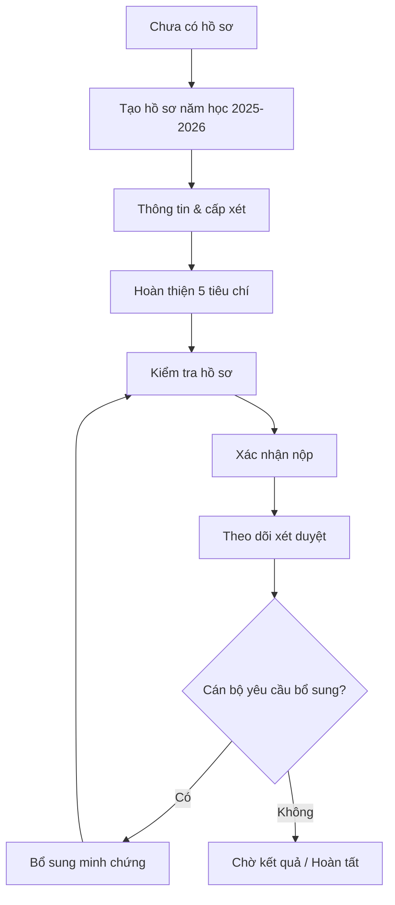

# Tình Trạng Flow, UX, UI Phía Sinh Viên

Ngày cập nhật: 05/07/2026  
Phạm vi: trải nghiệm sinh viên khi đăng ký, đăng nhập, tạo hồ sơ, bổ sung minh chứng, kiểm tra và nộp hồ sơ Sinh viên 5 tốt.

## 1. Tóm Tắt Hiện Trạng

Flow sinh viên hiện đã được gom về một workspace chính tại `/app/drafts`. Đây là thay đổi đúng hướng so với trạng thái cũ bị chia thành nhiều module như Draft, Wizard, Upload, AI Precheck, Cascade. Sinh viên hiện có thể bắt đầu từ đăng nhập hoặc đăng ký, được đưa về workspace hồ sơ, xem trạng thái, hoàn thiện 5 tiêu chí, kiểm tra trước khi nộp và theo dõi sau khi nộp.

Trải nghiệm hiện tại đã chuyển dần từ cảm giác “nhiều module hệ thống” sang “một luồng nộp hồ sơ”. Tuy nhiên, vẫn còn một số điểm cần hoàn thiện để production-ready hơn: timeline sau khi nộp còn đơn giản, upload minh chứng chưa đủ cấu trúc theo từng loại minh chứng, mobile navigation chưa có bottom nav, và vẫn cần test end-to-end với dữ liệu backend thật.

## 2. Entry Points

### 2.1 Landing Page

Màn đầu đã tập trung hơn vào mục tiêu sinh viên:

- Nêu rõ mục tiêu nộp hồ sơ Sinh viên 5 tốt.
- Có CTA đăng ký/đăng nhập.
- Có mô tả flow theo bước.
- Các module cho cán bộ/quản lý đã được đẩy xuống dưới, không còn chiếm toàn bộ first screen.

Tình trạng UX:

- Tốt hơn trước vì sinh viên không bị choáng bởi các thuật ngữ nghiệp vụ nội bộ.
- Vẫn có thể tinh gọn thêm nếu mục tiêu là portal chỉ dành cho sinh viên: first viewport nên ưu tiên trực tiếp “Bắt đầu tạo hồ sơ” và trạng thái hồ sơ năm học hiện tại.

### 2.2 Đăng Nhập

Route: `/login`

Hiện trạng:

- Có tài khoản demo.
- Sau đăng nhập, sinh viên được redirect về workspace hồ sơ mặc định.
- Copy đã bớt kỹ thuật hơn trước.

UX:

- Dễ vào hệ thống.
- Chưa có forgot password hoặc trạng thái lỗi form chi tiết theo từng field.

### 2.3 Đăng Ký

Route: `/signup`

Hiện trạng:

- Form đăng ký có các thông tin cơ bản của sinh viên.
- Sau đăng ký thành công, redirect theo role.
- Có checklist onboarding bên cạnh form.

UX:

- Rõ ràng hơn trạng thái cũ.
- Nên bổ sung validate trực quan hơn cho MSSV, email trường, mật khẩu và lỗi tài khoản đã tồn tại.

## 3. Luồng Chính Phía Sinh Viên

Route chính: `/app/drafts`

Workspace hiện chia thành các trạng thái lớn:

## 4. Trạng Thái Chưa Có Hồ Sơ

Khi sinh viên chưa có hồ sơ:

- Hiển thị empty state “Chưa có hồ sơ Sinh viên 5 tốt năm học 2025-2026”.
- Có CTA `Bắt đầu tạo hồ sơ`.
- Có `StudentFlowStepper` thể hiện bước đầu của quy trình.

UX:

- Đúng hướng vì sinh viên biết ngay việc cần làm.
- Empty state chưa quá giàu thông tin, nhưng đủ để bắt đầu.

UI:

- Card trung tâm, icon hồ sơ, CTA rõ.
- Có stepper hỗ trợ định hướng.

Khuyến nghị:

- Nên thêm mô tả ngắn: “Bạn sẽ cần hoàn thiện 5 tiêu chí và minh chứng trước khi nộp”.
- Nên hiển thị năm học rõ ở CTA hoặc heading.

## 5. Workspace Sau Khi Có Hồ Sơ

Sau khi có hồ sơ, workspace gồm các vùng chính:

- Header hồ sơ sinh viên.
- Khối `Bước tiếp theo`.
- Stepper quy trình.
- Tab nội bộ.
- Nội dung theo tab.
- Sticky bottom action.

### 5.1 Header Hồ Sơ

Hiển thị:

- Ảnh hồ sơ hoặc initials.
- Tên sinh viên, MSSV.
- Khoa, lớp.
- Năm học.
- Trạng thái hồ sơ.
- Cấp xét hiện tại.
- Tiến độ sẵn sàng.
- Nút cập nhật ảnh nếu hồ sơ còn chỉnh sửa được.

UX:

- Giúp sinh viên xác nhận mình đang chỉnh đúng hồ sơ.
- Tiến độ giúp nắm nhanh mức hoàn thiện.

Vấn đề còn lại:

- Progress readiness và progress `x/5 tiêu chí có minh chứng` là hai khái niệm khác nhau, cần giải thích nhẹ để tránh hiểu nhầm.

### 5.2 Khối “Bước Tiếp Theo”

Đây là điểm cải thiện quan trọng đã được thêm vào workspace.

Khối này hiển thị:

- Nhãn `Bước tiếp theo`.
- Một hành động chính theo trạng thái hồ sơ.
- Mô tả ngắn.
- `x/5 tiêu chí có minh chứng`.
- Readiness score.
- CTA chính.
- CTA phụ `Xem điều kiện 5 tiêu chí`.

Logic CTA hiện tại:

- Thiếu minh chứng: `Thêm minh chứng còn thiếu`.
- Đã có đủ minh chứng cơ bản nhưng chưa kiểm tra: `Kiểm tra hồ sơ`.
- Sẵn sàng: `Nộp hồ sơ`.
- Đã nộp: `Theo dõi xét duyệt`.
- Cần bổ sung: `Bổ sung minh chứng`.

UX:

- Rất đúng với feedback: sinh viên luôn biết “bấm gì tiếp theo”.
- Giảm tình trạng nhiều nút ngang hàng làm sinh viên phân vân.

UI:

- Card tonal nền xanh nhạt.
- CTA chính nổi bật, CTA phụ nhẹ hơn.
- Progress nhỏ giúp scan nhanh.

Điểm cần cải thiện tiếp:

- Nếu readiness thấp nhưng đủ 5 minh chứng, nên hiển thị lý do chính bên dưới CTA.
- Nên có trạng thái “Đã lưu tự động” nếu backend hỗ trợ timestamp lưu cuối.

### 5.3 StudentFlowStepper

Stepper hiện mô tả các giai đoạn:

- Tạo hồ sơ.
- Minh chứng.
- Kiểm tra.
- Nộp / Theo dõi.

UX:

- Giúp sinh viên biết mình đang ở đâu trong flow.
- Có action liên quan theo từng bước.

Vấn đề:

- Stepper hiện chưa hoàn toàn cố định khi scroll.
- Một số trạng thái có thể còn hơi tổng quát, ví dụ `Nộp / Theo dõi` gộp hai ý khác nhau.

Khuyến nghị:

- Nâng lên thành sticky stepper hoặc compact progress bar khi scroll.
- Tách rõ `Nộp` và `Theo dõi` nếu màn đủ chiều ngang.

## 6. Tabs Trong Workspace

Workspace hiện có 4 tab:

| Tab | Mục đích | Tình trạng |
| --- | --- | --- |
| `Thông tin & cấp xét` | Xem/chọn cấp xét, xem điều kiện cấp | Đã có |
| `5 tiêu chí` | Nhập chỉ số, thêm minh chứng theo từng tiêu chí | Đã có |
| `Kiểm tra hồ sơ` | Xem readiness, missing items, mở modal nộp | Đã có |
| `Theo dõi sau khi nộp` | Xem trạng thái và kết quả | Có nhưng còn đơn giản |

UX:

- Việc gom các bước vào một workspace là đúng.
- Tab giúp giảm cảm giác rời rạc giữa nhiều route.

Vấn đề:

- Nếu sinh viên mới dùng lần đầu, tab vẫn có thể tạo cảm giác “mình phải tự chọn tab”.
- Nên kết hợp tab với stepper và CTA chính để dẫn tuyến mạnh hơn.

## 7. Tab Thông Tin & Cấp Xét

Mục tiêu:

- Cho sinh viên biết đang xét cấp nào.
- Cho phép xem các cấp xét khác.
- Hiển thị điều kiện tổng quan của cấp được chọn.
- Cho phép đổi cấp xét nếu hồ sơ còn chỉnh sửa.

UX:

- Hữu ích cho sinh viên chưa biết mình nên aim cấp nào.
- Có so sánh mức phù hợp theo dữ liệu hiện có.

UI:

- Dạng card, danh sách cấp, summary điều kiện.
- Phù hợp với style Tonal / Layered Surface.

Vấn đề:

- Nội dung điều kiện có thể dài.
- Cần thêm microcopy “Bạn có thể đổi cấp xét trước khi nộp”.

## 8. Tab 5 Tiêu Chí

Đây là màn quan trọng nhất với sinh viên.

Hiện trạng:

- Có selector 5 tiêu chí.
- Mỗi tiêu chí có card chi tiết.
- Hiển thị điều kiện theo cấp xét hiện tại.
- Hiển thị chỉ số cần nhập.
- Hiển thị minh chứng liên quan.
- Có nút thêm minh chứng.
- Có kết quả kiểm tra cho tiêu chí.
- Có checklist nhỏ cho tiêu chí.
- Có nút `Lưu`, `Kiểm tra lại`, `Sang tiêu chí tiếp theo`.
- Ở tiêu chí cuối, nút chuyển thành `Tiếp tục đến bước kiểm tra`.

UX:

- Đã đáp ứng phần lớn feedback “làm checklist 5 tiêu chí rõ hơn”.
- Sinh viên có thể biết tiêu chí nào có minh chứng và tiêu chí nào chưa có.
- Điều kiện bắt buộc và minh chứng gợi ý đã nằm gần khu vực thao tác.

Vấn đề:

- Selector 5 tiêu chí dạng tab ngang có thể hơi chật trên mobile.
- Chưa có một bảng tổng hợp 5 tiêu chí luôn nhìn thấy cùng lúc ở đầu tab.
- Card tiêu chí vẫn khá dài, có thể gây scroll nhiều.

Khuyến nghị:

- Thêm summary list 5 tiêu chí phía trên:
  - Đạo đức: thiếu điểm rèn luyện.
  - Học tập: có GPA, thiếu bảng điểm.
  - Thể lực: chưa có minh chứng.
  - Tình nguyện: có 2 minh chứng.
  - Hội nhập: thiếu chứng chỉ.
- Mỗi item summary click vào đúng tiêu chí.
- Trên mobile, dùng accordion thay vì tab ngang.

## 9. Upload / Thêm Minh Chứng

Hiện trạng:

- Modal thêm minh chứng mở trong workspace.
- Có tiêu chí hiện tại.
- Có tên minh chứng.
- Có file đính kèm.
- Có thể lưu minh chứng trước dù chưa có file.
- Nếu có file, hệ thống upload và index.

UX:

- Đúng hướng vì sinh viên không bị chuyển route.
- Modal có scroll nội bộ, tránh tràn viewport.

Thiếu so với feedback:

- Chưa có field `Loại minh chứng`.
- Chưa có `Ghi chú cho cán bộ`.
- Chưa có drag/drop rõ ràng.
- Chưa có gợi ý minh chứng theo từng tiêu chí ngay trong modal.
- Sau upload, chưa có phản hồi trực quan kiểu “minh chứng này giúp tiêu chí X đủ hơn”.

Khuyến nghị ưu tiên:

- Thêm select loại minh chứng.
- Thêm textarea ghi chú.
- Hiển thị “Gợi ý minh chứng nên có” theo tiêu chí.
- Sau upload thành công, highlight tiêu chí vừa được cải thiện.

## 10. Tab Kiểm Tra Hồ Sơ

Hiện trạng:

- Hiển thị readiness score.
- Có nút kiểm tra lại.
- Có danh sách các điểm còn thiếu.
- Mỗi missing item có severity.
- Có nút thêm minh chứng từ missing item.
- Nộp hồ sơ dùng `SubmitConfirmationModal`.

UX:

- Đúng hướng vì trước khi nộp có bước review.
- Không submit thẳng, giảm rủi ro sinh viên nộp nhầm.

Vấn đề:

- Chưa đủ mạnh về cảnh báo “Sau khi nộp hồ sơ sẽ khóa”.
- Cần trình bày rõ hơn nhóm:
  - Có thể nộp.
  - Nên bổ sung.
  - Bắt buộc bổ sung.

Khuyến nghị:

- Thêm box “Bạn sắp nộp hồ sơ” với 3 dòng:
  - Hồ sơ sẽ khóa sau khi nộp.
  - Chỉ chỉnh sửa khi cán bộ yêu cầu bổ sung.
  - Bạn còn X điểm cần chú ý.

## 11. Submit Confirmation Modal

Hiện trạng:

- Đã dùng modal xác nhận nộp.
- Có application, precheck, evidenceCounts.
- Có trạng thái pending.

UX:

- Đúng với feedback: không cho submit thẳng.
- Giúp sinh viên có bước xác nhận cuối.

Cần kiểm tra thêm:

- Nội dung modal có đủ rõ về các tiêu chí thiếu hay chưa.
- Modal có hiển thị đầy đủ trên mobile hay không.

## 12. Tab Theo Dõi Sau Khi Nộp

Hiện trạng:

- Hiển thị trạng thái hồ sơ.
- Hiển thị final status/final level nếu có.
- Hiển thị final note nếu có.
- Hiển thị thời điểm nộp, thời điểm chốt, người chốt.
- Có nút quay lại tổng quan.

UX:

- Có điểm bắt đầu cho theo dõi.
- Chưa đủ sâu để trả lời câu hỏi “hồ sơ đang ở đâu?”.

Thiếu so với feedback:

- Chưa có timeline theo từng mốc.
- Chưa có trạng thái từng tiêu chí đang được cán bộ nào xử lý.
- Chưa có hạn phản hồi nếu bị yêu cầu bổ sung.
- Chưa có lý do bổ sung nổi bật theo từng tiêu chí trong timeline.

Khuyến nghị:

- Thêm timeline:
  - Đã nộp hồ sơ.
  - Đang xét tiêu chí học tập.
  - Cần bổ sung tiêu chí thể lực.
  - Đã hoàn tất xét duyệt.
- Mỗi item timeline cần có thời gian, người/cấp xử lý, trạng thái, action nếu cần.

## 13. Sticky Bottom Action

Hiện trạng:

- Đã có sticky action dưới cùng khi hồ sơ còn chỉnh sửa.
- Có nút `Kiểm tra hồ sơ`.
- Có nút `Nộp hồ sơ` hoặc `Gửi lại hồ sơ`.
- Có text còn bao nhiêu tiêu chí chưa có minh chứng.

UX:

- Đúng feedback: hành động chính luôn sẵn khi scroll.
- Giảm việc sinh viên phải kéo lên/xuống tìm nút.

Vấn đề:

- Cần test trên mobile để tránh che nội dung.
- Có thể cần thêm padding bottom ở các modal hoặc màn dài.

## 14. Sidebar Sinh Viên

Hiện trạng:

Sidebar sinh viên đã được rút gọn, gồm:

- Tổng quan.
- Hồ sơ của tôi.
- Thành tích & giấy xác nhận.
- Kho sự kiện.
- Thông báo.
- Trợ lý SV5T.

UX:

- Đã loại bỏ nhiều module kỹ thuật khỏi cấp điều hướng chính.
- Các route như `AI Precheck`, `Cascade`, `Wizard`, `Upload` không còn là menu chính độc lập.

Vấn đề:

- Feedback đề xuất chỉ cần: Tổng quan, Hồ sơ của tôi, Minh chứng, Thông báo, Theo dõi kết quả.
- Hiện vẫn có `Kho sự kiện` và `Trợ lý SV5T`; hai mục này hữu ích nhưng có thể làm menu sinh viên dài hơn cần thiết.

Khuyến nghị:

- Nếu muốn tối giản hơn, đổi thành:
  - Tổng quan.
  - Hồ sơ của tôi.
  - Minh chứng.
  - Thông báo.
  - Theo dõi kết quả.
- Đưa `Kho sự kiện` vào trong bước thêm minh chứng.
- Đưa `Trợ lý SV5T` thành nút phụ trong workspace.

## 15. Ngôn Ngữ UI

Đã cải thiện:

- Dùng nhiều cụm hành động theo ngôn ngữ sinh viên hơn:
  - Hồ sơ của tôi.
  - Kiểm tra hồ sơ.
  - Nộp hồ sơ.
  - Theo dõi xét duyệt.
  - Bổ sung minh chứng.

Còn cần rà:

- Một số màn phụ/legacy vẫn có thể còn thuật ngữ kỹ thuật như AI, Cascade, indexing, review task.
- Cần quét toàn bộ text để thống nhất:
  - `AI Precheck` -> `Kiểm tra hồ sơ`.
  - `Cascade Review` -> `Theo dõi xét duyệt`.
  - `Indexing` -> `Đang xử lý file`.
  - `Review task` -> `Việc cán bộ đang xét`.

## 16. Tình Trạng Kỹ Thuật Liên Quan Đến Crash

Đã xử lý các rủi ro chính:

- `/app/drafts` từng crash do biến `isLastCriterion` chưa khai báo trong tab 5 tiêu chí.
- Đã thêm lại logic nhận diện tiêu chí cuối.
- Đã normalize level cũ:
  - `truong` -> `school`
  - `dhdn` -> `university`
  - `thanh-pho` -> `city`
  - `trung-uong` -> `central`
- Đã guard ở cả API current application và workspace để tránh dữ liệu cache/backend cũ làm vỡ UI.

Trạng thái kiểm tra:

- `npm.cmd run build` pass.
- Khi chưa đăng nhập, `/app/drafts` trả redirect về `/login`, không timeout.

## 17. Đánh Giá Production-Ready Phía Sinh Viên

Ước lượng hiện tại: khoảng 80-85% cho UI/UX flow sinh viên.

Đã đạt:

- Có workspace chính.
- Có stepper.
- Có khối next action.
- Có checklist theo tiêu chí.
- Có modal xác nhận nộp.
- Có sticky bottom action.
- Có trạng thái bổ sung.
- Có redirect đúng role.
- Đã giảm crash do dữ liệu cũ.

Chưa hoàn chỉnh:

- Timeline sau nộp còn yếu.
- Upload minh chứng chưa đủ cấu trúc.
- Summary 5 tiêu chí chưa đủ trực quan ở một màn.
- Mobile navigation chưa tối ưu.
- Copy legacy chưa được quét toàn bộ.
- Cần E2E test với tài khoản sinh viên thật.
- Cần xác nhận backend submit không còn lỗi 500.

## 18. Ưu Tiên Cải Thiện Tiếp Theo

### P0

- Kiểm tra lại flow submit thật với backend.
- Thêm E2E test cho `/app/drafts`.
- Đảm bảo mọi dữ liệu level cũ được normalize ở toàn bộ API, không chỉ current application.

### P1

- Thêm summary 5 tiêu chí ở đầu tab `5 tiêu chí`.
- Nâng cấp modal upload:
  - Loại minh chứng.
  - Ghi chú cho cán bộ.
  - Gợi ý theo tiêu chí.
  - Drag/drop.
- Làm timeline sau khi nộp.

### P2

- Tối giản sidebar sinh viên thêm một bước.
- Chuyển navigation mobile thành bottom nav hoặc drawer.
- Rà toàn bộ copy kỹ thuật.

## 19. Kết Luận

Flow sinh viên hiện đã đi đúng hướng: thay vì nhiều module rời rạc, sinh viên có một workspace trung tâm để biết mình đang ở bước nào, còn thiếu gì, và cần bấm gì tiếp theo. Điểm cần đầu tư tiếp là làm rõ hơn tình trạng từng tiêu chí, nâng trải nghiệm upload minh chứng, và bổ sung timeline xét duyệt sau khi nộp.

Mục tiêu sản phẩm nên tiếp tục giữ nguyên: sinh viên không cần hiểu hệ thống vận hành thế nào; sinh viên chỉ cần biết hồ sơ của mình đang thiếu gì, làm gì tiếp theo, và sau khi nộp thì đang được xử lý đến đâu.
