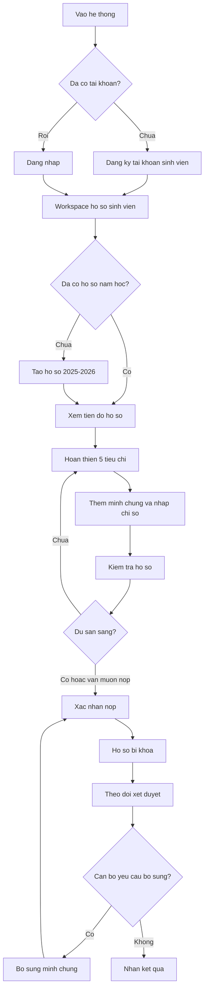

# Bao cao tinh trang UI/UX flow sinh vien

Ngay lap: 2026-07-05  
Pham vi: frontend `namtot`, flow sinh vien dang ky/dang nhap, tao ho so, them minh chung, kiem tra va nop ho so Sinh vien 5 tot.

## 1. Tom tat dieu hanh

He thong da co day du cac module can thiet cho sinh vien: dang ky tai khoan, dang nhap, tao ho so nam hoc, chon cap xet, nhap chi so, quan ly minh chung theo tieu chi, tien kiem, nop ho so va theo doi trang thai.

Van de chinh khong nam o viec thieu chuc nang, ma nam o viec flow bi phan tan, UI hien qua nhieu module ky thuat, va hanh dong tiep theo chua luon ro rang. Voi mot sinh vien moi, cam giac hien tai la "dang vao mot he thong lon co nhieu module" hon la "dang duoc huong dan nop ho so 5 tot".

Muc tieu cai thien nen la gom tat ca ve mot trai nghiem trung tam:

```text
Tao ho so -> Hoan thien 5 tieu chi -> Kiem tra -> Nop -> Theo doi
```

## 2. Tinh trang hien tai theo route va component

### 2.1 Landing page

Route lien quan:

- `/`
- `src/features/core/components/LandingPage.tsx`

Tinh trang hien tai:

- Landing gioi thieu nhieu module: ho so ca nhan, kho minh chung, AI precheck, cascade review, review queue, manager dashboard, audit/export, VNPT/eKYC.
- Co CTA vao login va workspace.
- Noi dung mang tinh product overview hon la onboarding cho sinh vien.

Danh gia UX:

- Tot cho demo toan he thong.
- Chua toi uu cho sinh vien muon nop ho so ngay.
- Sinh vien co the bi nhieu boi cac khai niem "AI", "Cascade", "Review Queue", "Manager Dashboard".

Van de UI:

- First viewport chua tap trung vao viec duy nhat: "Bat dau nop ho so Sinh vien 5 tot".
- CTA chinh va CTA phu chua tach ro theo vai tro sinh vien.

Khuyen nghi:

- Neu nguoi dung chua dang nhap, landing nen co CTA chinh duy nhat: `Bat dau nop ho so`.
- Cac module quan tri/can bo nen dua xuong duoi hoac an voi sinh vien.
- Nen co mot block ngan: `Ban can lam 4 buoc: Tao ho so, Them minh chung, Kiem tra, Nop`.

## 3. Flow dang ky va dang nhap

### 3.1 Dang nhap

Route/component:

- `/login`
- `src/routes/login.tsx`

Tinh trang hien tai:

- Co quick role de dien san tai khoan demo.
- Mac dinh email la `student@dut.udn.vn`.
- Dang nhap thanh cong redirect ve `/app`.

Danh gia UX:

- Rat nhanh cho demo va test.
- De gay nham giua "tai khoan demo" va "tai khoan that".
- Neu session cu con ton tai, nguoi dung co the bi redirect vao `/app` theo role cu.

Rui ro:

- Sinh vien moi bam dang ky/dang nhap nhung vao nham dashboard can bo neu local session dang giu account khac.
- `/app` la route chung, nen sau login sinh vien phai tu tim dung noi tiep tuc ho so.

Khuyen nghi:

- Sau login thanh cong, redirect theo role:
  - Sinh vien: `/app/drafts` hoac workspace sinh vien moi.
  - Can bo: `/app/queue`.
  - Quan ly: `/app/analytics`.
- Tren login, tach ro khu vuc demo account:
  - `Dung tai khoan demo`
  - `Dang nhap tai khoan cua toi`
- Khi chon role demo, hien badge `Tai khoan demo`.

### 3.2 Dang ky

Route/component:

- `/signup`
- `src/routes/signup.tsx`

Tinh trang hien tai:

- Form co cac truong: ho ten, ma sinh vien, email, lop, khoa, so dien thoai, mat khau, xac nhan mat khau.
- Dang ky thanh cong se set auth va redirect ve `/app`.

Danh gia UX:

- Truong thong tin can thiet tuong doi day du.
- Copy dang ky dung muc dich: dang ky tai khoan sinh vien de bat dau ho so.
- Sau dang ky nen vao thang workspace ho so, khong nen vao dashboard chung.

Van de UI:

- Form dang ky chua co giai thich dau la bat buoc/dau la tuy chon bang visual ro.
- Chua co preview "sau khi tao tai khoan ban se duoc tao ho so nam hoc".
- Chua co validation inline ro rang truoc submit, phu thuoc nhieu vao toast.

Khuyen nghi:

- Sau dang ky redirect ve `/app/drafts` hoac `/app/wizard`.
- Them checklist nho ben canh form:
  - Tao tai khoan sinh vien
  - Tao ho so nam hoc
  - Them minh chung 5 tieu chi
  - Nop ho so
- Validation nen hien ngay duoi field, khong chi toast.

## 4. Layout app sau dang nhap

Route/component:

- `/app`
- `src/features/core/components/AppLayout.tsx`
- `src/components/layout/Sidebar.tsx`
- `src/components/layout/TopBar.tsx`

Tinh trang hien tai:

- Layout dung sidebar ben trai va main content scroll doc.
- `main` co `h-screen overflow-y-auto`.
- TopBar co title, subtitle, search, notification va action.

Danh gia UX:

- Desktop layout kha ro.
- Sidebar giup dieu huong nhanh nhung voi sinh vien dang co qua nhieu muc.
- TopBar khong sticky, nen khi scroll sau sinh vien mat nut hanh dong chinh.

Van de scroll:

- Main content scroll rieng, sidebar co the co scroll rieng tuy noi dung.
- Cac nut quan trong nhu `Luu`, `Kiem tra`, `Nop` co the bi troi khoi viewport.
- Neu form dai, sinh vien phai scroll len/xuong nhieu de xem dieu kien va thao tac.

Khuyen nghi UI:

- Lam sticky top stepper cho flow sinh vien.
- Lam sticky bottom action bar trong workspace sinh vien:

```text
Da luu tu dong 2 phut truoc                         [Kiem tra ho so] [Nop chinh thuc]
```

- Sidebar sinh vien nen rut gon:

```text
Tong quan
Ho so cua toi
Minh chung
Thong bao
Theo doi ket qua
```

- Cac module `AI Precheck`, `Cascade`, `Audit`, `VNPT`, `SmartUX` khong nen la menu doc lap voi sinh vien. Nen nhung vao flow duoi dang hanh dong:
  - `Kiem tra ho so`
  - `Goi y cap xet`
  - `Xac thuc thong tin`

## 5. Flow ho so sinh vien hien tai

### 5.1 Cac man hinh lien quan

Route/component chinh:

- `/app/drafts`
- `src/features/application/components/DraftWorkspace.tsx`
- `src/features/application/components/StudentApplicationWorkspace.tsx`
- `src/features/application/components/StudentOverview.tsx`
- `src/features/application/components/StudentFlowStepper.tsx`
- `src/features/application/components/SubmitConfirmationModal.tsx`

Tinh trang hien tai:

- Co nhieu component cung xu ly flow sinh vien.
- `DraftWorkspace` co tao ho so, chon cap aim, xem 5 tieu chi, mo workspace minh chung, nop chinh thuc.
- `StudentApplicationWorkspace` day du hon: tab thong tin, criteria, precheck, tracking, modal xac nhan nop.
- `SubmitConfirmationModal` da ton tai va co UX tot cho buoc nop.

Rui ro san pham:

- Flow bi duplicate giua `DraftWorkspace` va `StudentApplicationWorkspace`.
- Co noi nut `Nop chinh thuc` submit truc tiep, trong khi noi khac dung modal xac nhan.
- Sinh vien co the khong biet nen vao `Ho so cua toi`, `Wizard`, `Upload`, `Evidence`, hay `AI Precheck`.

Khuyen nghi:

- Chon mot workspace sinh vien duy nhat lam source of truth.
- Uu tien `StudentApplicationWorkspace` vi co:
  - Stepper
  - Tabs
  - Precheck
  - Tracking
  - Submit modal
- Bien `DraftWorkspace` thanh redirect/light wrapper den workspace moi, hoac loai bo dan.

## 6. Flow tao ho so

Tinh trang hien tai:

- Neu chua co ho so, man hinh hien empty state va nut `Bat dau tao ho so`.
- Khi click, goi API `POST /api/applications/current/start`.
- Ho so mac dinh nam hoc `2025-2026`, cap aim mac dinh `school`.

Danh gia UX:

- Empty state de hieu.
- CTA ro.
- Sau khi tao ho so can dua nguoi dung vao checklist tiep theo ro hon.

Khuyen nghi UI:

Sau khi tao ho so, hien ngay:

```text
Ho so da duoc tao

Buoc tiep theo:
1. Chon cap xet mong muon
2. Nhap thong tin theo 5 tieu chi
3. Tai minh chung
```

Nen co progress mac dinh:

```text
Tien do ho so: 0/5 tieu chi co minh chung
```

## 7. Flow chon cap xet

Tinh trang hien tai:

- Co cac card cap aim: cap Truong, cap Dai hoc Da Nang, cap Thanh pho, cap Trung uong.
- Co label goi y nhu `Phu hop voi ho so hien tai`, `Can bo sung them`.

Danh gia UX:

- Visual card de scan.
- Y tuong "aim" tot, giup sinh vien chon muc tieu.

Van de:

- Tu "Aim" co the la thuat ngu khong quen voi sinh vien.
- Goi y cap xet nen noi ro vi sao phu hop/chua phu hop.

Khuyen nghi:

- Doi `Aim` thanh `Cap xet mong muon`.
- Moi cap can co 3 dong:
  - Dieu kien chinh
  - Ho so hien tai cua ban
  - Minh chung con thieu

Vi du:

```text
Cap Thanh pho
Can: GPA >= 3.2, tinh nguyen >= 5 ngay, co minh chung hoi nhap
Ban da co: GPA 3.6, tinh nguyen 3 ngay
Con thieu: 2 ngay tinh nguyen, minh chung hoi nhap
```

## 8. Flow 5 tieu chi

Tinh trang hien tai:

- Co 5 tieu chi: dao duc, hoc tap, the luc, tinh nguyen, hoi nhap.
- Moi tieu chi co yeu cau va nut mo workspace minh chung.
- `StudentApplicationWorkspace` co du lieu chi tiet hon voi metric input, evidence, checklist.

Danh gia UX:

- Co day du noi dung.
- Nhung thong tin con trai tren nhieu man, sinh vien phai vao workspace minh chung de thuc hien.

Van de:

- Sinh vien can biet "tieu chi nay da du chua" ngay tai man hinh tong.
- Hien tai co nhieu card va text, nhung call-to-action tiep theo chua luon noi ro.
- Neu moi tieu chi chi co nut `Mo workspace minh chung`, sinh vien mat ngu canh cua tieu chi dang xem.

Khuyen nghi:

Nen thiet ke 5 tieu chi thanh checklist trung tam:

```text
Dao duc tot
Trang thai: Thieu diem ren luyen
Can lam: Nhap diem ren luyen va them phieu xac nhan khoa
[Nhap diem] [Them minh chung]

Hoc tap tot
Trang thai: Da co du lieu co ban
Da co: GPA, bang diem
[Xem minh chung] [Them minh chung]
```

Moi card tieu chi nen co:

- Trang thai
- So minh chung da co
- Chi so da nhap
- Viec con thieu
- Nut hanh dong ro

## 9. Flow minh chung

Route/component:

- `/app/evidence`
- `src/features/evidence/components/EvidenceWorkspace.tsx`
- `src/features/evidence/components/UploadEvidence.tsx`
- `src/features/evidence/components/StudentEvidenceCard.tsx`

Tinh trang hien tai:

- Co workspace minh chung theo tieu chi.
- Co danh sach tieu chi ben trai, noi dung o giua, yeu cau chinh thuc ben phai.
- Co modal them minh chung.
- Ho tro upload file PDF/JPG/JPEG/PNG toi da 10MB.

Danh gia UX:

- Cac thanh phan can thiet da co.
- Layout 3 cot tot cho desktop.
- Requirement ben phai huu ich, giup sinh vien biet dieu kien.

Van de:

- Tren mobile hoac man hinh nho, layout 3 cot co nguy co dai va can scroll nhieu.
- Modal upload chua phan loai minh chung bang dropdown ro.
- Text "indexing/OCR" hoac trang thai xu ly file neu co nen viet lai theo ngon ngu sinh vien.
- Sau khi upload, nen cap nhat ngay card tieu chi: "Tieu chi nay da co 1 minh chung".

Khuyen nghi UI:

Form upload nen co cau truc:

```text
Tieu chi: Hoc tap tot

Loai minh chung
[Bang diem / Giay khen / Chung chi / Khac]

Ten minh chung
[Bang diem hoc ky 1]

File dinh kem
[Keo tha file hoac chon file]

Ghi chu gui can bo
[...]

[Luu minh chung]
```

Nen co goi y minh chung theo tieu chi:

- Dao duc: phieu diem ren luyen, xac nhan khoa, xac nhan khong ky luat.
- Hoc tap: bang diem, giay khen, NCKH, hoc bong.
- The luc: giay chung nhan sinh vien khoe, giai the thao.
- Tinh nguyen: giay xac nhan chien dich, hien mau, tiep suc mua thi.
- Hoi nhap: TOEIC/IELTS/HSK/JLPT, hoi thao quoc te, giao luu sinh vien.

## 10. Flow kiem tra truoc khi nop

Component:

- `src/features/application/components/SubmitConfirmationModal.tsx`
- `src/features/application/components/StudentApplicationWorkspace.tsx`

Tinh trang hien tai:

- Co modal xac nhan nop kha day du.
- Modal hien:
  - Cap dang ky
  - Trang thai
  - Muc san sang
  - Tom tat 5 tieu chi
  - Canh bao sau khi nop ho so se bi khoa

Danh gia UX:

- Day la diem tot cua flow hien tai.
- Copy canh bao ro rang.
- Co hanh dong `Quay lai bo sung` va `Xac nhan nop`.

Van de:

- Modal chua duoc dung thong nhat o moi noi.
- `DraftWorkspace` co nut submit truc tiep.

Khuyen nghi:

- Bat buoc moi nut `Nop chinh thuc` phai mo modal xac nhan.
- Neu readiness score thap, nut chinh nen la:

```text
[Tiep tuc bo sung] [Van nop ho so]
```

- Neu thieu minh chung bat buoc, nen canh bao manh hon:

```text
Ho so con thieu minh chung bat buoc. Neu van nop, ho so co kha nang bi yeu cau bo sung.
```

## 11. Flow nop ho so

API/component:

- `POST /api/applications/:id/submit`
- `src/features/application/hooks/useApplication.ts`
- `src/features/application/api/application.ts`

Tinh trang thuc te khi kiem thu:

- Tao tai khoan test thanh cong.
- Tao ho so test thanh cong.
- Them minh chung cho 5 tieu chi thanh cong.
- Buoc submit ho so moi bi loi 500.

Tai khoan test da tao:

```text
Email: codex.sv5t.385430@dut.udn.vn
Student code: CDX385430
Application ID: 965204d2-8197-4053-b213-c969c86a4892
Submit status: loi 500, chua nop thanh cong
```

Loi backend:

```text
PrismaClientKnownRequestError
Invalid tx.auditLog.create() invocation
Transaction API error: Transaction not found.
```

File lien quan:

- `sv5tot-hackaithon-backend/src/modules/applications/application.helpers.ts`
- `sv5tot-hackaithon-backend/src/modules/applications/applications.service.ts`

Tac dong UX:

- Sinh vien moi lam day du buoc nhung khong nop duoc.
- Neu UI chi hien toast chung chung `Khong the nop ho so`, sinh vien khong biet co mat du lieu hay khong.
- Day la blocker nghiem trong cho flow sinh vien.

Khuyen nghi:

- Sua backend submit truoc khi toi uu UI.
- UI nen co error state rieng cho submit:

```text
Chua the nop ho so luc nay
Du lieu cua ban da duoc luu. Vui long thu lai sau hoac lien he can bo phu trach.
[Thu lai] [Xem ho so da luu]
```

## 12. Flow sau khi nop va theo doi

Tinh trang hien tai:

- Tai khoan demo `student@dut.udn.vn` da co ho so `under_review`.
- Ho so co readiness score, minh chung, metrics, review tasks theo tung tieu chi.
- Co thong tin trang thai: accepted, rejected, waiting, supplement_required.

Danh gia UX:

- Backend du lieu theo doi kha day du.
- UI can hien thanh timeline de sinh vien hieu ho so dang o dau.

Khuyen nghi UI:

Man tracking nen co:

```text
Ho so da nop
Nop luc: 02/07/2026 11:37

Trang thai tung tieu chi:
- Dao duc tot: Chua dat / bi tu choi
- Hoc tap tot: Da dat
- The luc tot: Dang cho xet
- Tinh nguyen tot: Dang cho xet
- Hoi nhap tot: Dang cho xet

Neu can bo yeu cau bo sung:
[Bo sung minh chung]
```

Nen co timeline:

```text
Da tao ho so
Da them minh chung
Da nop ho so
Can bo dang xet
Can bo yeu cau bo sung / Hoan tat
```

## 13. Navigation hien tai va de xuat cho sinh vien

Tinh trang hien tai:

- Sidebar thay doi theo role.
- Voi sinh vien, van co nhieu muc mang tinh module.

De xuat menu sinh vien:

```text
Tong quan
Ho so cua toi
Minh chung
Thong bao
Ket qua xet duyet
```

Khong nen hien truc tiep:

```text
AI Precheck
Cascade
Audit
VNPT
SmartUX
```

Neu can giu cac tinh nang nay:

- `AI Precheck` -> nut `Kiem tra ho so`.
- `Cascade` -> block `Goi y cap xet phu hop`.
- `Audit` -> tab nho `Lich su cap nhat`.
- `VNPT/eKYC` -> step `Xac thuc thong tin`, chi hien khi can.

## 14. He thong ngon ngu UI

Van de hien tai:

- Mot so text trong source bi loi encoding khi doc file, vi du ky tu tieng Viet hien thanh `H sơ`, `Đăng ký`.
- Tren browser, mot so noi van hien dung, nhung can kiem tra lai toan bo pipeline encoding.
- Co nhieu thuat ngu ky thuat khong than thien voi sinh vien.

Tu nen tranh voi sinh vien:

- Backend auth
- AI low
- Cascade review
- Review task
- Indexing
- Evidence Card
- Audit

Tu nen dung:

- Dang nhap
- Can kiem tra them
- Goi y cap xet phu hop
- Dang xu ly file
- Viec can bo dang xet
- Lich su cap nhat

## 15. Cac diem UI nen cai thien

### 15.1 Hierarchy hanh dong

Moi man nen co mot CTA chinh:

- Chua co ho so: `Bat dau tao ho so`
- Dang thieu du lieu: `Tiep tuc hoan thien`
- Thieu minh chung: `Them minh chung con thieu`
- Du co ban: `Kiem tra ho so`
- Sau kiem tra: `Nop chinh thuc`
- Da nop: `Theo doi xet duyet`

### 15.2 Trang thai va feedback

Can hien ro:

- Da luu hay chua.
- Ho so co bi khoa khong.
- Co the nop hay chua.
- Tieu chi nao con thieu.
- Sau khi upload file da xu ly den dau.

### 15.3 Empty state

Moi empty state nen co:

- Ly do rong.
- Hanh dong tiep theo.
- Vi du cu the.

Vi du:

```text
Chua co minh chung Hoc tap tot
Ban co the tai bang diem, giay khen hoc tap hoac minh chung NCKH.
[Them minh chung Hoc tap]
```

### 15.4 Error state

Loi submit nen khong chi toast. Nen co inline panel:

```text
Khong the nop ho so
Du lieu cua ban da duoc luu. He thong dang gap loi khi khoa ho so de gui xet duyet.
Ma loi: requestId ...
[Thu lai] [Lien he ho tro]
```

### 15.5 Mobile

Can uu tien:

- Sidebar thanh drawer hoac bottom nav.
- Stepper rut gon thanh progress bar.
- Bottom action sticky.
- Card tieu chi xep doc.
- Modal upload full-screen sheet.

## 16. De xuat flow moi cho sinh vien

### 16.1 Flow tong



### 16.2 Cau truc workspace moi

```text
Header:
  Ho so Sinh vien 5 tot 2025-2026
  Trang thai: Dang hoan thien / San sang nop / Da nop

Stepper:
  Thong tin -> 5 tieu chi -> Kiem tra -> Nop -> Theo doi

Main:
  Card tong quan tien do
  Checklist 5 tieu chi
  Goi y viec can lam tiep theo

Sticky action:
  Da luu tu dong ...       [Kiem tra ho so] [Nop chinh thuc]
```

## 17. Uu tien thuc hien

### P0 - Bat buoc sua truoc demo/nop that

- Sua loi backend submit 500 lien quan Prisma transaction va audit log.
- Dam bao moi tai khoan sinh vien moi co the tao va nop ho so thanh cong.
- Sau login/signup sinh vien redirect ve dung workspace sinh vien.

### P1 - Cai thien flow chinh

- Chon mot component workspace sinh vien duy nhat.
- Dung `SubmitConfirmationModal` thong nhat cho moi hanh dong nop.
- Tao checklist 5 tieu chi lam trung tam.
- Rut gon sidebar sinh vien.
- Them sticky action bar.

### P2 - Cai thien do ro va cam giac san pham

- Viet lai microcopy theo ngon ngu sinh vien.
- Them empty state va error state ro rang.
- Hien "viec can lam tiep theo" sau moi buoc.
- Them timeline sau khi nop.

### P3 - Hoan thien responsive/mobile

- Bottom nav mobile.
- Stepper mobile compact.
- Upload modal thanh full-screen sheet.
- Kiem tra scroll tren viewport nho.

## 18. Ket luan

He thong hien co nen tang chuc nang tot, nhung UX sinh vien can duoc gom lai thanh mot hanh trinh duy nhat. Sinh vien khong nen phai hieu cau truc module cua he thong; UI can lien tuc tra loi 4 cau hoi:

1. Toi dang o buoc nao?
2. Ho so cua toi con thieu gi?
3. Toi can bam nut nao tiep theo?
4. Sau khi nop, ho so cua toi dang o dau?

Huong cai thien dung nhat la chuyen trai nghiem tu "dashboard nhieu module" sang "tro ly nop ho so 5 tot theo checklist".
